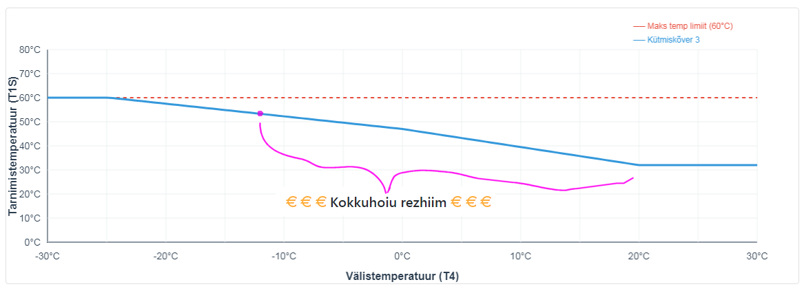

# Midea M-Thermal Arctic 8 kW – tööloogika optimeerimise projekt

## 1. Projekti eesmärk

**KAKS TÖÖREZHIIMI** (manuaalse ümberlülitusega)

###    Kokkuhoiu rezhiim   
  - nö. soojemate ilmadega, **−12 °C välistemperatuurini**
  - "**Curve 3 + Offset 12**"
  - −12 °C juures on see **target 53.3 °C** (vt. graafik allpool)
  - mis peaks olema veel "odavama elektrikulu" piirkonnas
  - toetuda võimalikult kompressori tööle
  - elektriline lisaküte asub osalema alles siis, kui hädavajalik
  - aga siiski mitte ka kompressorit hulluks ajada, leida minimaalse elektritarbimise kombinatsioon (parameetrite abil, vt. allpool)

###    Krõbeda külma rezhiim   
  - külmem kui **−12 °C välistemperatuur**
  - **manuaalselt target 60 °C** peale
  - "OK, päev on pakaseline, kuluta rohkem energiat/raha"
  - kui külmad möödas, siis manuaalselt tagasi "Curve 3 + Offset 12" peale

## 2. Olulised parameetrid

(maaletooja sõnastus)

Nende settingutega saab määrata mis hetkeni töötab kompressoriga ja elektritenni kasutamise loogika:

| Parameeter    | Kirjeldus                                                                                                           |
|---------------|---------------------------------------------------------------------------------------------------------------------|
| `T4HMAX`      | Välisõhutemperatuur, millest alates töötab madalal võimsusel või elektri/välise allikaga.                           |
| `T4HMIN`      | Välisõhutemperatuur, millest alates kütet enam ei tooda ja elektritenn võtab üle.                                   |
| `dT1_IBH_ON`  | Elektritenni sisselülitus hüsterees soovitud väljuva vee temperatuuri ja hetke väljuva vee temperatuur delta järgi. |
| `t_IBH_Delay` | Ajaline viide kompressori sisselülitus hetkest, millal võib vajadusel elektritenni sisse lülitada.                  |
| `T4_IBH_ON`   | Välisõhutemperatuur, millest alates on lubatud elektritenni võimsuse puudujäägi korral lülitada.                    |

Leitavad ka manuaalist (kuigi ilma kirjelduseta):
- [https://www.emhbt.com/Manual/controller/controller-2024/kjrh-120l2/operation-manualsmarthome](https://www.emhbt.com/Manual/controller/controller-2024/kjrh-120l2/operation-manualsmarthome)
- (kontroller `KJRH-120L2`)

## 3. Hetke ideed parameetritega

ja (arvatavad) tehase seadistused (TS)

| Parameeter    | TS     | Idee                                                                                 |
|---------------|--------|--------------------------------------------------------------------------------------|
| `T4HMAX`      | ?      | Ei muuda eriti asja (võimalik valida vahemikus 20-35 kraadi)                         |
| `T4HMIN`      | -15 °C | Langetada -25 °C peale                                |
| `dT1_IBH_ON`  | 5 °C   | Jätta 5 °C (võimalik valida 2-10 kraadise hüstereesi vahel)                          |
| `t_IBH_Delay` | 30 min | Jätta 30 min (võimalik valida 15-120 min)                                            |
| `T4_IBH_ON`   | -5 °C  | Langetada -13 °C peale (võimalik valida +10 kuni -15) |

## 4. Parameetrite valiku loogika

### `dT1_IBH_ON = 5 °C`
- Väldib elektritenni liiga varajast sekkumist.
- Annab kompressorile võimaluse sagedust tõsta.
- Sobib radiaatorkütte inertsiga.

### `t_IBH_Delay = 30 min`
- Väldib lühiajalistest kõikumistest tulenevat lisakütte aktiveerimist.
- Säilitab kompressori prioriteedi.

### `T4_IBH_ON = -13 °C`
- Elektritenni osalus ei ole lubatud enne kui on -13 °C.

### `T4HMIN = -25 °C`
- Tagab, et kompressor töötab võimalikult madala välistemperatuurini.
- Väldib olukorda, kus süsteem lülitub liiga vara puhtalt elektrirežiimi.

### `T4HMAX`
- Mõjutab ülemist välistemperatuuri piiri, kus süsteem võib lülituda teisele loogikale.
- Ei ole kriitiline talvises tööpiirkonnas, kuid vajab kinnitust sobiva väärtuse osas.

## 5. Hoone

- Hoone: ~150 m² kahekorruseline puitmaja
- Soojusjaotus: radiaatorid
- Tunnetuslik piir:
  - kuni ~-12 °C välisõhutemperatuurini piisab ~53 °C kütteveest
  - alla -12 °C vajab hoone ~58–60 °C
